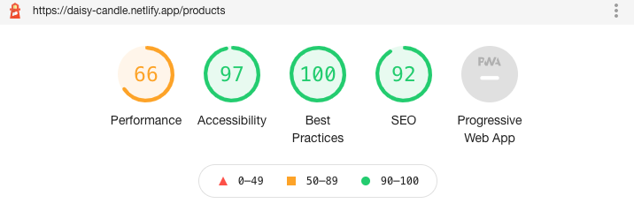

# Daisy Candles 

## Status
[](https://app.netlify.com/sites/daisy-candles/deploys)

### Lighthouse




##  Introduction

Daisy Candles is a single-page web app created using React. It is mostly focused on products page in which user is able to view all the products from firebase database. The products can be filtered as well. User is also able to naviagte to different pages in the app.


## Getting Started

1. Install the project dependencies
```shell
npm install
```

2. Run the application
```shell
npm run start
```

## Component Map

- App
    - HomePage
    - AboutUs
    - Contact
    - ShopProducts
        - ProductFilter
        - ProductList
            - [Product]
            - Pagination

## Paths

- `/`: `HomePage`
- `/products`: `ShopProducts`
    - `/products/filter`
- `/product/product-name`: `ProductPage`
- `/about`: `AboutUs`

## Live Website

https://daisy-candles.netlify.app